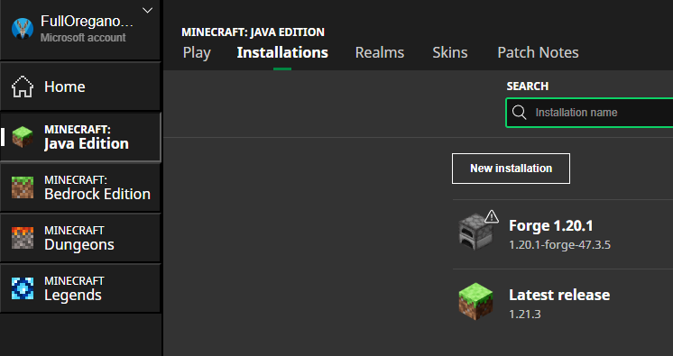

## Prerequisites
- Minecraft: Java Edition
- Java Installed -- if you've never installed Java, get it from [here](https://www.java.com/download/ie_manual.jsp).
- `Adams_MC_Instructions-main.zip` -- the folder this README is in. Download from GitHub [here](https://github.com/AdamJSchofield/Adams_MC_Instructions/archive/refs/heads/main.zip) or with `Code > Download Zip`. Extract this to a new folder after you've downloaded it.

### Start Minecraft at least once

Starting the correct version of Minecraft that matches the server version at least once will install some necessary files to continue.

These instructions are written for the Minecraft Launcher from the Xbox app/store on Windows:

1. Launch the Minecraft Launcher from Xbox on Windows
2. Select `Minecraft: Java Edition` from the left
3. Across the top, select `Installations`
4. Name this whatever you want
5. IMPORTANT: Select version `1.20.1 Release`. You have to scroll a ways down. This is not the newest release because of mod compatability.
6. From the `Installations` tab, hover the installtion you just created and select `Play`.

## Step 1: Install Forge client

After you have started Minecraft v1.20.1 at least once:

1. Open the `Step 1` folder from the directory this README is in.
2. Exit Minecraft and the Minecraft Launcher.
3. Run the file `forge-1.20.1-47.3.5-installer.jar` with Java.
4. Select `Install client`.
5. After this is completeted - Restart the Minecraft Launcher
6. Repeat the steps from `Prerequisites` to create a new 'Installation'. This time select version `1.20.1-forge-47.3.5`.

You should now have something like this:

7. From the `Installations` tab, hover the installtion you just created with subtext `1.20.1-forge-47.3.5` and select `Play`.

## Step 2: Install the mods

To 'install' these, we are just copying files into a directory that Minecraft will load in the future.

1. Open the `Step 2` folder from the directory this README is in. 
2. Highlight or shift+click all of the files in this this folder. Copy them to your clipboard, or ctrl+c.
3. Launch Minecraft (`1.20.1-forge-47.3.5`) if you haven't already.
4. From the starting screen in Minecraft select `Mods`
5. In the bottom left, select `Open Mods Folder`. It open a folder like `C:\Users\{yourUserName}\AppData\Roaming\.minecraft\mods`.
6. Paste the contents of the `Step 2` folder into the mods folder that Minecraft opened for you.
7. Restart Minecraft. Decline to update any mods (I don't know what the imapct of that would be yet).

## Step 3:

1. Restart Minecraft
2. Get the server address from myself or someone else with the address.
3. Join the server! :)
